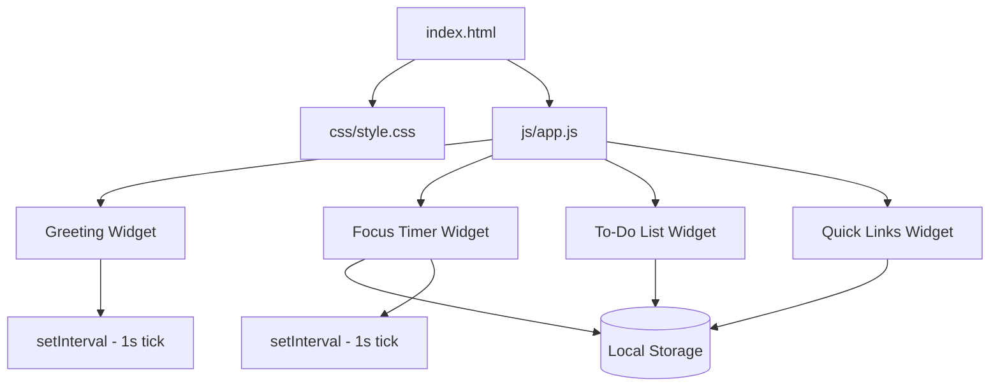
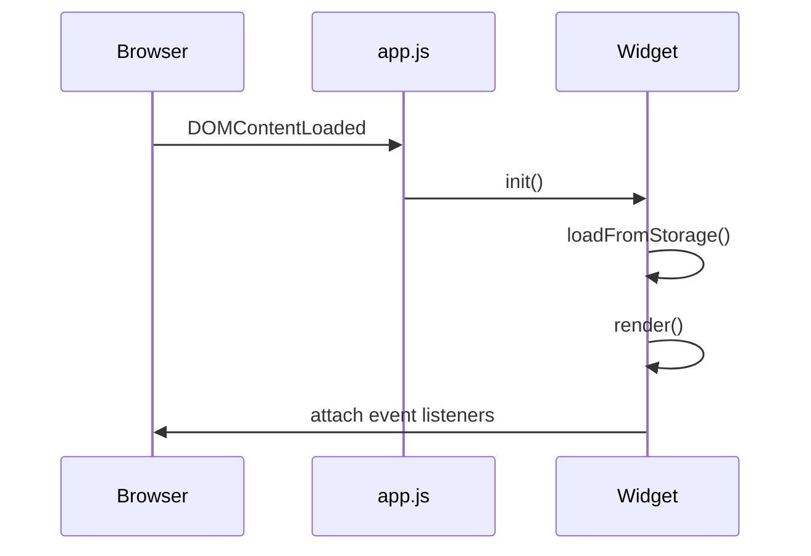

# Design Document

## Overview

The personal dashboard is a single-page web application that runs entirely in the browser with no build step, no backend, and no external dependencies. It is composed of four self-contained widgets — Greeting, Focus Timer, To-Do List, and Quick Links — arranged in a responsive CSS Grid layout. All mutable state (tasks and links) is persisted to the browser's Local Storage API. The entire application is delivered as three files: `index.html`, `css/style.css`, and `js/app.js`.

The design philosophy is deliberate simplicity: one HTML file, one CSS file, one JS file. Each widget is implemented as a plain JavaScript module-style object (an IIFE or plain object literal) that owns its own DOM subtree, state, and storage key. There is no virtual DOM, no reactive framework, and no module bundler.

---

## Architecture

The application follows a flat, widget-centric architecture. There is no central state store; each widget manages its own state independently and writes directly to Local Storage when state changes.



### Initialization Flow



Each widget exposes a single `init()` function called from a top-level `DOMContentLoaded` listener in `app.js`. The `init()` function loads persisted state, renders the initial DOM, and attaches event listeners.

---

## Components and Interfaces

### Widget Contract

Every widget follows this informal interface:

```js
const WidgetName = (() => {
  // private state
  let state = {};

  function loadFromStorage() { /* read from localStorage, handle errors */ }
  function saveToStorage()   { /* write to localStorage */ }
  function render()          { /* update DOM from state */ }
  function init()            { /* loadFromStorage → render → attachListeners */ }

  return { init };
})();
```

### Greeting Widget

- Reads `new Date()` on every tick.
- Uses `setInterval(tick, 1000)` started in `init()`.
- Derives greeting string from `date.getHours()`.
- No Local Storage interaction (time is always live).

DOM targets:
- `#greeting-message` — "Good morning / afternoon / evening / night"
- `#greeting-time` — HH:MM (padded with leading zero)
- `#greeting-date` — e.g. "Wednesday, 14 May 2025"

### Focus Timer Widget

- State: `{ remaining: 1500, running: false, intervalId: null }`
- `remaining` is in seconds (25 × 60 = 1500).
- `start()` — sets `running = true`, starts `setInterval(tick, 1000)`.
- `stop()` — clears interval, sets `running = false`.
- `reset()` — calls `stop()`, sets `remaining = 1500`, re-renders.
- On tick: decrements `remaining`; if `remaining === 0` calls `onComplete()`.
- `onComplete()` — stops timer, applies `.timer-complete` CSS class for visual indication.
- No Local Storage (timer state is ephemeral by design).

DOM targets:
- `#timer-display` — MM:SS
- `#timer-start`, `#timer-stop`, `#timer-reset` — control buttons

### To-Do List Widget

- State: `Task[]` (array, ordered by insertion).
- Storage key: `"dashboard_todos"`.
- `addTask(label)` — validates non-empty/non-whitespace, pushes new Task, saves, renders.
- `editTask(id, newLabel)` — validates, updates label, saves, renders.
- `toggleTask(id)` — flips `completed`, saves, renders.
- `deleteTask(id)` — filters out task, saves, renders.
- `render()` — clears `#todo-list` and rebuilds from state array.
- Each task `<li>` contains: checkbox, label span (double-click to edit), edit button, delete button.
- Inline edit: replaces label span with `<input>`, confirms on Enter or blur, cancels on Escape.

DOM targets:
- `#todo-input` — new task text input
- `#todo-add` — add button
- `#todo-list` — `<ul>` container
- `#todo-validation` — inline validation message span

### Quick Links Widget

- State: `Link[]` (array, ordered by insertion).
- Storage key: `"dashboard_links"`.
- `addLink(label, url)` — validates label non-empty and URL valid (uses `URL` constructor), pushes, saves, renders.
- `deleteLink(id)` — filters out link, saves, renders.
- `render()` — clears `#links-grid` and rebuilds from state array.
- Each link renders as `<a target="_blank" rel="noopener noreferrer">` styled as a button.

DOM targets:
- `#link-label-input`, `#link-url-input` — add form inputs
- `#link-add` — add button
- `#links-grid` — container for link buttons
- `#link-validation` — inline validation message span

---

## Data Models

### Task

```js
{
  id: string,        // crypto.randomUUID() or Date.now().toString()
  label: string,     // non-empty, trimmed
  completed: boolean // false on creation
}
```

Stored as JSON array under key `"dashboard_todos"`.

### Link

```js
{
  id: string,   // crypto.randomUUID() or Date.now().toString()
  label: string, // non-empty, trimmed
  url: string    // valid absolute URL
}
```

Stored as JSON array under key `"dashboard_links"`.

### Storage Schema

| Key | Value | Widget |
|---|---|---|
| `dashboard_todos` | `Task[]` JSON | To-Do List |
| `dashboard_links` | `Link[]` JSON | Quick Links |

No other keys are written. The Greeting and Focus Timer widgets hold no persistent state.

---

## Correctness Properties

*A property is a characteristic or behavior that should hold true across all valid executions of a system — essentially, a formal statement about what the system should do. Properties serve as the bridge between human-readable specifications and machine-verifiable correctness guarantees.*

### Property 1: Time formatting correctness

*For any* `Date` object, the time-formatting function SHALL produce a string matching `HH:MM` where HH is the zero-padded 24-hour hour and MM is the zero-padded minute.

**Validates: Requirements 1.1**

---

### Property 2: Date formatting completeness

*For any* `Date` object, the date-formatting function SHALL produce a string that contains the full weekday name, the full month name, the numeric day, and the 4-digit year.

**Validates: Requirements 1.2**

---

### Property 3: Greeting selection correctness

*For any* integer hour in [0, 23], `getGreeting(hour)` SHALL return exactly one of the four expected strings ("Good morning", "Good afternoon", "Good evening", "Good night") and the returned string SHALL correspond to the correct hour range as specified.

**Validates: Requirements 1.3, 1.4, 1.5, 1.6**

---

### Property 4: Timer countdown decrement

*For any* starting `remaining` value in [1, 1500] and any number of ticks N where N ≤ remaining, after N timer ticks the `remaining` value SHALL equal `start − N`.

**Validates: Requirements 2.2, 2.3**

---

### Property 5: Timer display formatting

*For any* integer seconds value in [0, 1500], `formatTime(seconds)` SHALL produce a string in `MM:SS` format where MM is the zero-padded minutes and SS is the zero-padded remaining seconds.

**Validates: Requirements 2.3, 2.7**

---

### Property 6: Timer reset invariant

*For any* timer state (any `remaining` value, any `running` flag), calling `reset()` SHALL always produce `remaining === 1500` and `running === false`.

**Validates: Requirements 2.5**

---

### Property 7: Task addition correctness

*For any* non-empty, non-whitespace-only string label and any existing task list, calling `addTask(label)` SHALL increase the list length by exactly 1, and the new task SHALL have the trimmed label, `completed === false`, and a unique `id`.

**Validates: Requirements 3.1**

---

### Property 8: Task addition rejection

*For any* string composed entirely of whitespace characters (including the empty string), calling `addTask(label)` SHALL leave the task list unchanged.

**Validates: Requirements 3.2**

---

### Property 9: Task edit correctness and rejection

*For any* existing task and any non-empty, non-whitespace-only new label, `editTask(id, newLabel)` SHALL update the task's label to the trimmed new label. *For any* existing task and any whitespace-only or empty new label, `editTask(id, newLabel)` SHALL leave the task's label unchanged.

**Validates: Requirements 3.4, 3.5**

---

### Property 10: Task completion toggle round-trip

*For any* task with any initial `completed` state, calling `toggleTask(id)` twice SHALL return the task to its original `completed` state.

**Validates: Requirements 3.6**

---

### Property 11: Task deletion correctness

*For any* task list containing at least one task and any task `id` present in that list, calling `deleteTask(id)` SHALL produce a list that does not contain a task with that `id` and whose length is exactly one less than before.

**Validates: Requirements 3.7**

---

### Property 12: Task storage round-trip

*For any* sequence of task mutations (add, edit, toggle, delete), serializing the task list to Local Storage and then deserializing it SHALL produce an array that is deeply equal to the current in-memory task list.

**Validates: Requirements 3.8, 3.9, 6.1**

---

### Property 13: Link addition correctness

*For any* non-empty label string and any string that is a valid absolute URL, calling `addLink(label, url)` SHALL increase the links list length by exactly 1, and the new link SHALL have the trimmed label, the original URL, and a unique `id`.

**Validates: Requirements 4.1**

---

### Property 14: Link addition rejection

*For any* empty label string or any string that is not a valid absolute URL, calling `addLink(label, url)` SHALL leave the links list unchanged.

**Validates: Requirements 4.2**

---

### Property 15: Link deletion correctness

*For any* links list containing at least one link and any link `id` present in that list, calling `deleteLink(id)` SHALL produce a list that does not contain a link with that `id` and whose length is exactly one less than before.

**Validates: Requirements 4.4**

---

### Property 16: Link storage round-trip

*For any* sequence of link mutations (add, delete), serializing the links list to Local Storage and then deserializing it SHALL produce an array that is deeply equal to the current in-memory links list.

**Validates: Requirements 4.5, 4.6, 6.2**

---

### Property 17: Storage error resilience

*For any* value stored under a dashboard storage key that is `null`, `undefined`, or not valid JSON representing an array, calling `loadFromStorage()` for that key SHALL return an empty array and SHALL NOT throw an exception.

**Validates: Requirements 6.3**

---

## Error Handling

### Local Storage Errors

All reads from Local Storage are wrapped in a `try/catch`. If `JSON.parse` throws or the parsed value is not an array, the widget initialises with `[]`. This covers:
- Storage quota exceeded (write failures are silently ignored; the in-memory state remains correct)
- Corrupted or manually edited storage values
- Private browsing modes where Local Storage may be unavailable

```js
function loadFromStorage(key) {
  try {
    const raw = localStorage.getItem(key);
    const parsed = JSON.parse(raw);
    return Array.isArray(parsed) ? parsed : [];
  } catch {
    return [];
  }
}
```

### URL Validation

The `URL` constructor is used for validation. An invalid URL throws a `TypeError`, which is caught to produce the inline validation message.

```js
function isValidUrl(str) {
  try {
    new URL(str);
    return true;
  } catch {
    return false;
  }
}
```

### Input Validation

All user-supplied strings are trimmed before use. Empty or whitespace-only strings are rejected with an inline validation message displayed in the widget's dedicated validation element (`#todo-validation`, `#link-validation`). Validation messages are cleared on the next successful submission or when the input changes.

### Timer Edge Cases

- Calling `start()` while already running is a no-op (guarded by `if (state.running) return`).
- Calling `stop()` or `reset()` while not running is safe (clearing a null interval is a no-op).
- The tick handler checks `remaining > 0` before decrementing to prevent negative values.

---

## Testing Strategy

### Approach

The testing strategy uses a dual approach:
- **Unit / example-based tests** for specific behaviors, edge cases, and integration points.
- **Property-based tests** for universal correctness properties across a wide input space.

Since all widget logic is pure JavaScript with no framework, tests run in a Node.js environment (or browser-compatible test runner) with Local Storage mocked via a simple in-memory map.

### Property-Based Testing Library

**[fast-check](https://github.com/dubzzz/fast-check)** (JavaScript) is the chosen PBT library. It integrates with any test runner (Jest, Vitest) and supports arbitrary generators for strings, integers, arrays, and custom structures.

Each property test is configured to run a minimum of **100 iterations**.

Each property test is tagged with a comment in the format:
```
// Feature: personal-dashboard, Property N: <property text>
```

### Test File Structure

```
tests/
  greeting.test.js      # Properties 1, 2, 3
  timer.test.js         # Properties 4, 5, 6 + examples for 2.1, 2.4, 2.6
  todo.test.js          # Properties 7–12 + examples for 3.3
  links.test.js         # Properties 13–16 + example for 4.3
  storage.test.js       # Property 17
```

### Property Test Mapping

| Property | Test file | fast-check arbitraries |
|---|---|---|
| P1 Time formatting | greeting.test.js | `fc.date()` |
| P2 Date formatting | greeting.test.js | `fc.date()` |
| P3 Greeting selection | greeting.test.js | `fc.integer({ min: 0, max: 23 })` |
| P4 Timer countdown | timer.test.js | `fc.integer({ min: 1, max: 1500 })`, `fc.integer` for N |
| P5 Timer format | timer.test.js | `fc.integer({ min: 0, max: 1500 })` |
| P6 Timer reset | timer.test.js | `fc.record({ remaining: fc.integer({min:0,max:1500}), running: fc.boolean() })` |
| P7 Task add | todo.test.js | `fc.string().filter(s => s.trim().length > 0)` |
| P8 Task add rejection | todo.test.js | `fc.stringOf(fc.constantFrom(' ', '\t', '\n'))` |
| P9 Task edit | todo.test.js | `fc.string()` for new label |
| P10 Task toggle | todo.test.js | `fc.boolean()` for initial state |
| P11 Task delete | todo.test.js | `fc.array(taskArb)` with random target |
| P12 Task storage round-trip | todo.test.js | `fc.array(taskArb)` |
| P13 Link add | links.test.js | `fc.webUrl()` for URL, `fc.string` for label |
| P14 Link add rejection | links.test.js | `fc.oneof(fc.constant(''), fc.string())` for invalid URL |
| P15 Link delete | links.test.js | `fc.array(linkArb)` with random target |
| P16 Link storage round-trip | links.test.js | `fc.array(linkArb)` |
| P17 Storage resilience | storage.test.js | `fc.oneof(fc.string(), fc.constant(null))` |

### Unit / Example Tests

- **Timer init**: assert `remaining === 1500`, display shows `"25:00"` (Req 2.1)
- **Timer stop**: start, advance 3 ticks, stop, assert remaining frozen (Req 2.4)
- **Timer complete**: set remaining to 1, tick once, assert `running === false` and `.timer-complete` class present (Req 2.6)
- **Task inline edit mode**: trigger edit on a task, assert input element is rendered (Req 3.3)
- **Link opens new tab**: assert rendered anchor has `target="_blank"` and `rel="noopener noreferrer"` (Req 4.3)
- **Layout smoke**: assert all four widget containers exist in the DOM (Req 5.1)

### Mocking Strategy

Local Storage is mocked with a plain object implementing `getItem`, `setItem`, and `removeItem`. The mock is injected via a module-level variable or passed as a parameter to `loadFromStorage` / `saveToStorage` to keep widget logic testable without a browser environment.
